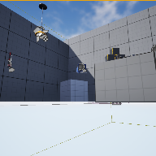

# Project Name  VRSampleMod7

## Description

A continuation of the in class demonstration code based on UE default Virtual Reality template. This one adds an interactive dimmable list, and controlling dimmer switch.    
 
## Usage
Clone, or download the zip, to a local directory. Open in Unreal Engine 5.4 or newer

## Attributions

